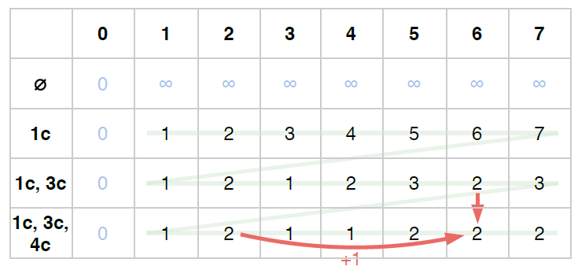

**Gonçalves**  
**Taïga**  
**Groupe D1b**  
**Encadrant: Vuillemot Romain**
# TD #5 : Rendu de monnaie
## 1. Algorithme Glouton
---
L'arlgorithme Glouton est assez rapide et est simple à implémenter. Son code est le suivant:

```python
# Exercice 1.1
def Monnaie_Gloutonne(S,M):
    T=[0]*len(S)
    Q=0
    while M != 0:
        p_max = 0
        for p in range(len(S)):
            if S[p]<=M:
                p_max=p # S est ordonné dans l'ordre croissant
        if S[p_max] == 0:
            print("impossible")
            return
        nb = M//S[p_max]
        M = M%S[p_max]
        T[p_max]+= nb
        Q+=nb
    return (T,Q)
```
Si nous voulons limiter le nombre de chaque pièces, nous pouvons créer la liste D contenant le nombre de chaque pièce contenue dans S, et nous vérifions que chaque entiers dans T est inférieur aux entiers dans D. Nous modifions le code de l'exercice 1.1 de la manière suivante:
```python
def Monnaie_Gloutonne_D(S,M,D):
    T=[0]*len(S)
    Q=0
    while M != 0:
        p_max = 0
        for p in range(len(S)):
            if S[p]<=M and T[p]<D[p]: # ajout d'une condition
                p_max=p # S est ordonné dans l'ordre croissant
        if S[p_max] == 0 or D[p_max]==0: #condition D[p] à vérifier car p_max=0 dans le pire des cas
            print("impossible")
            return
        nb = M//S[p_max]
        M = M%S[p_max]
        if nb>D[p_max]: # si on a besoin de plus de pièces de type p_max que ce qu'on dispose,
            M+= S[p_max]*(nb-D[p_max]) # alors on s'arrête dès qu'on les a toutes utilisées, et donc on corrige la valeur de M
            nb=D[p_max]
        T[p_max]+= nb
        Q+=nb
    return (T,Q)
```
Nous allons tester cet algorithme avec trois cas. Le premier cas est le suivant:
```python
S = [1,2,5,10,20,50,100,200,500,1000,2000,5000,10000]
print(Monnaie_Gloutonne(S,23665))
```
Le résultat obtenu est `([0, 0, 1, 1, 0, 1, 1, 0, 1, 1, 1, 0, 2], 9)`, ce qui est effectivement la méthode la plus optimale.
Testons maintenant le cas suivant:
```python
S = [1 ,2 ,5 ,10,20,50,100,200,500,1000,2000,5000,10000]
D = [10,10,10,10,10,10,10 ,10 ,10 ,10  ,10  ,10  ,1    ]
print(Monnaie_Gloutonne_D(S,23665,D))
```
Ici, on manque de pièce de valeur 10 000. Le programme en tient compte et compense ainsi cette pièce par deux pièces de valeur 5 000, comme le montre le résultat affiché: `([0, 0, 1, 1, 0, 1, 1, 0, 1, 1, 1, 2, 1], 10)`.
Enfin, testons la cas suivant:
```python
S = [1 ,7 ,23]
D = [10,10,10]
print(Monnaie_Gloutonne_D(S,28,D))
```
Ici, le résultat affiché est `([5, 0, 1], 6)`, ce qui n'est clairement pas le résultat optimal. Cet algorithme ne fonctionne donc que dans certains cas.
## 2. Chemin minimal dans un arbre
---
Essayons maintenant de résoudre le problème en construisant les solutions possibles sous forme d'arbre, et en faisant une résolution du problème à l'aide d'un parcours de l'arbre en largeur. Créons une fonction permettant de créer cet arbre:
```python
# Exercice 2.1
def Monnaie_arbre(S,M):
    F = []
    A = {M:{}}
    F.append(M)
    while len(F)>0:
        m = F.pop(0)
        for p in S:
            if p <= m:
                if m-p in A:
                    A[m-p][m]=p # ajout d'un arc dans un noeud existant
                else:
                    A[m-p]={} # ajout d'un noeud et d'un arc
                    A[m-p][m]=p
                F.append(m-p)
    return A
```
Si nous utilisions la liste `S = [1,7,23]`, le dictionnaire renvoyé par cette fonction serait donc équivalent au graphe suivant: 
Maintenant, nous allons ajouter des étapes dans cette fonction pour pouvoir réaliser le parcours en largeur:
```python
# Exercice 2.2
def Monnaie_parcours_largeur(S,M):
    F = []
    A = {M:{}}
    F.append(M)
    trouve = False
    while len(F)>0 and not trouve :
        m = F.pop(0)
        for p in S:
            if p <= m:
                if m-p not in A: # Le premier parent crée pour chaque noeud est le chemin le plus court
                    A[m-p]={} # ajout d'un noeud et d'un arc
                    A[m-p][m]=p
                F.append(m-p)
                if m-p == 0:
                    trouve = True
    if len(F)==0 and not trouve:
        print("Il y a un problème dans les calculs !")
        return
    else:
        noeud = 0
        T = [0]*len(S)
        Q = 0
        while noeud != M:
            parents = list(A[noeud].items())
            noeud,p = parents[0][0],parents[0][1]
            for i in range(len(T)):
                if S[i]==p:
                    T[i]+=1
            Q+=1
    return (T,Q)   
```
Testons cette fonction avec la liste S suivante:
```python
print("\n  Tests exercice 2.2")
S = [1,7,23]
print(Monnaie_parcours_largeur(S,28)) 
```
Le résultat affiché est `([0, 4, 0], 4)`. Contrairement à l'algorithme de Glouton, le parcours en largeur permet bien de trouver la solution optimale pour le rendu de monnaie. Le problème maintenant est sa complexité. Nous allons donc étudier un autre algorithme.
## 3. Algorithme de Programmation Dynamique
---
Cet algorithme repose sur un principe de mémoïsation, permettant de contourner un problème de récursivité qui diminuerait considérablement la vitesse de résolution du problème étudié. Ce nouvel algorithme se repose sur la création d'une matrice équivalente au tableau suivant: 
Les lignes correspondent aux pièces disponibles, et les colonnes correspondent à la valeur que nous voulons obtenir. Pour une case [i][m] (i étant la ligne, et m la colonne), la valeur affichée correspond au nombre de pièces total à utiliser pour optimiser la résolution du problème. Pour choisir cette valeur, on procède de la manière suivante:
1. On regarde combien de pièce on doit utiliser pour obtenir la valeur m sans utiliser la pièce i (i.e. on regarde la valeur de la case [i-1][m])
2. On regarde combien de pièce on doit utiliser pour obtenir la valeur m-S[i] (i.e. on regarde la valeur de la case [i][m-S[i]), puis on rajoute 1 à cette valeur, car on utilise une pièce de type i pour passer de m-S[i] à m.
3. On compare quelle méthode permet de minimiser le nombre de pièce à obtenir.
 
En suivant cette démarche, la dernière valeur du tableau correspondra donc au résultat de notre problème à nous. Le code de cette méthode est le suivant:
```python
# Exercice 3.1
def Monnaie_v1(S,M):
    mat = np.zeros((len(S)+1,M+1))
    for i in range(len(S)+1):
        for m in range(M+1):
            if m==0:
                mat[i][m]=0
            elif i==0:
                mat[i][m]=math.inf
            else:
                a,b=math.inf,math.inf
                if m-S[i-1]>=0: # on utilise la pièce de type i
                    a = 1+mat[i][m-S[i-1]]
                if i>=1: # on n'utilise pas la pièce de type i
                    b = mat[i-1][m]
                mat[i][m] = min(a,b)
    return mat[-1][-1]
```
Testons ce programme avec les listes suivantes:
```python
S = [1,2,5,10,20,50,100,200,500,1000,2000,5000,10000]
print(Monnaie_v1(S,23665))
S = [1,7,23]
print(Monnaie_v1(S,28))
```
Les résultats obtenus sont respectivement 9 et 4, ce qui est conforme au résultat attendu.
Maintenant, modifions cette fonction pour nous afficher les différentes pièces à utiliser. Une première idée serait de d'abord créer le tableau, puis de remonter dans la tableau (en partant de la fin) pour trouver le nombre de chaque pièce à utiliser. Le code est le suivant:
```python
# Exercice 3.2  (version 1)
def Monnaie_v2(S,M):
    mat = np.zeros((len(S)+1,M+1))
    for i in range(len(S)+1):
        for m in range(M+1):
            if m==0:
                mat[i][m]=0
            elif i==0:
                mat[i][m]=math.inf
            else:
                a,b=math.inf,math.inf
                if m-S[i-1]>=0: # on utilise la pièce de type i
                    a = 1+mat[i][m-S[i-1]]
                if i>=1: # on n'utilise pas la pièce de type i
                    b = mat[i-1][m]
                mat[i][m] = min(a,b)
    Q=mat[-1][-1]
    T = [0]*len(S)
    m=M
    while m!=0:
        i=0;trouve=False
        while i<=len(S) and not trouve:
            if Q-1 == mat[-1][m-S[i]]: # On cherche la pièce à utiliser pour qu'on puisse payer le montant restant avec Q-1 pièces
                m=m-S[i] # le montant restant à payer
                Q=Q-1 # pièces restantes à utiliser
                trouve = True # On a trouvé la pièce qu'on voulait, on arrête donc la boucle
                T[i]+=1
            else:
                i+=1
        if not trouve:
            print("Stooop !! Il y a un problème !")
            return
    return(T,mat[-1][-1])
```
Ce code, bien que fonctionnel, n'est pas l'idéal si on veut rajouter la liste D des pièces disponibles. Nous allons donc créer une deuxième version de cette fonction. Dans cette deuxième version, dans chaque case du tableau, nous stockerons à la fois le nombre de pièce optimal pour trouver m, mais aussi la liste T des pièces à utiliser. Le principe de création de chaque liste T est la même que pour trouver le nombre de pièce. Le code de cette nouvelle fonction est le suivant:
```python
# Exercice 3.2  (version 2)
def Monnaie_v2(S,M):
    s=len(S)
    mat = np.zeros((s+1,M+1))
    mat_T = [[[0]*s]*(M+1)]*(s+1) # pièces à utiliser
    for i in range(s+1):
        for m in range(M+1):
            if m==0:
                mat[i][m]=0
            elif i==0:
                mat[i][m]=math.inf
            else:
                a,b=math.inf,math.inf
                if m-S[i-1]>=0: # on utilise la pièce de type i
                    a = 1+mat[i][m-S[i-1]]
                if i>=1: # on n'utilise pas la pièce de type i
                    b = mat[i-1][m]
                if a<b: # c'est plus efficace d'utiliser la pièce de type i
                    mat[i][m] = a
                    mat_T[i][m] = mat_T[i][m-S[i-1]][:]
                    mat_T[i][m][i-1]+= 1
                else:
                    mat[i][m] = b
                    mat_T[i][m] = mat_T[i-1][m][:]
    return (mat_T[-1][-1],mat[-1][-1])
```
Testons-le avec les listes suivantes:
```python
S = [1,2,5,10,20,50,100,200,500,1000,2000,5000,10000]
print(Monnaie_v2(S,23665))
S = [1,7,23]
print(Monnaie_v2(S,28))
```
Les résultats affichés sont respectivement `([0, 0, 1, 1, 0, 1, 1, 0, 1, 1, 1, 0, 2], 9.0)` et `([0, 0, 1, 1, 0, 1, 1, 0, 1, 1, 1, 0, 2], 9.0)`, ce qui correspond aux résultats attendus. Cette fonction a en plus l'avantage d'être bien plus rapide que la méthode du parcours en largeur.

Pour finir, améliorons cette fonction pour prendre en compte la liste D contenant le nombre des différentes pièces disponibles. Pour cela, nous allons rajouter une condition permettant de vérifier que les membres de la liste T sont toujours inférieurs à ceux de la liste D:
```python
# Exercice 3.3  (version non fonctionnelle)
def Monnaie_v3(S,M,D):
    s=len(S)
    mat = np.zeros((s+1,M+1))
    mat_T = [[[0]*s]*(M+1)]*(s+1) # pièces à utiliser  
    for i in range(s+1):
        for m in range(M+1):
            if m==0:
                mat[i][m]=0
            elif i==0:
                mat[i][m]=math.inf
            else:
                a,b=math.inf,math.inf
                if i>=1: # on n'utilise pas la pièce de type i
                    b = mat[i-1][m]
                if m-S[i-1]>=0 and mat_T[i][m-S[i-1]][i-1]<D[i-1]: # on utilise la pièce de type i, si on en dispose
                    a = 1+mat[i][m-S[i-1]]
                if a<b: # c'est plus efficace d'utiliser la pièce de type i
                    mat[i][m] = a
                    mat_T[i][m] = mat_T[i][m-S[i-1]][:]
                    mat_T[i][m][i-1]+= 1
                else:
                    mat[i][m] = b
                    mat_T[i][m] = mat_T[i-1][m][:]
    return (mat_T[-1][-1],mat[-1][-1])
```
Testons cette fonction pour les listes suivantes:
```python
S = [1 , 2, 5,10,20,50,100,200,500,1000,2000,5000,10000]
D = [10, 0, 2,1 ,0 ,10,10 ,10 ,10 ,10  ,10  ,1   ,1    ]
print(Monnaie_v3(S,23665,D))
S = [1 , 2, 5,10,20,50,100,200,500,1000,2000,5000,10000]
D = [10, 0, 2,1 ,0 ,10,10 ,10 ,10 ,10  ,10  ,2   ,1    ]
print(Monnaie_v3(S,23665,D))
```
Les résultats obtenus sont `([0, 0, 0, 0, 0, 0, 0, 0, 0, 0, 0, 0, 0], inf)` et `([0, 0, 1, 1, 0, 1, 1, 0, 1, 0, 9, 1, 0], 15.0)`. Le premier résultat est clairement aberrant, et le second l'est aussi, car on n'utilise pas la pièce de 10 000, alors qu'il y en a une de disponible. Le problème vient du fait que si `mat_T[i][m-S[i-1]][i-1] >= D[i-1]]`, alors on aura forcément `b <= a=math.inf`, et donc on n'utilisera aucune pièce i. Pour résoudre ce problème, on modifie la démarche de notre problème:
1. On regarde combien de pièce on doit utiliser pour obtenir la valeur m sans utiliser la pièce i (i.e. on regarde la valeur de la case [i-1][m])
2. On regarde combien de pièce on doit utiliser pour obtenir la valeur m-S[i] puis on rajoute 1 à cette valeur. Si cette valeur est plus grande que le nombre de pièce disponible, alors on ne retient pas cette solution.
3. Si l'étape 2 ne peut pas être réalisé, alors pour toutes les types de pièces i2, on regarde combien de pièce on doit tuiliser pour obtenir la valeur m-S[i2], puis on rajoute 1 à cette valeur, car on doit utiliser une pièce i2 pour passer de m-S[i2] à m. Ensuite, on choisit la pièce i2 telle que le nombre de pièce à utiliser est minimal, et que l'on dispose suffisament de pièce de type i2.
4. On compare quelle méthode permet de minimiser le nombre de pièce à obtenir.

Les étapes 1 et 2 de cette démarche sont identiques à la démarche précédente. Cependant, l'étape 3 est nouveau: son utilité est de chercher des solutions pour résoudre le problème en utilisant les pièces de type i, même si celles-ci ne sont pas disponibles en quantité suffisante.
Le nouveau programme obtenu est le suivant:
```python
# Ecercice 3  (version fonctionnelle)
def Monnaie_v3(S,M,D):
    s=len(S)
    mat = np.zeros((s+1,M+1))
    mat_T = [[[0]*s]*(M+1)]*(s+1) # pièces à utiliser  
    for i in range(s+1):
        for m in range(M+1):
            if m==0:
                mat[i][m]=0
            elif i==0:
                mat[i][m]=math.inf
            else:
                a,b=math.inf,math.inf
                if i>=1: # on n'utilise pas la pièce de type i
                    b = mat[i-1][m]
                if m-S[i-1]>=0 and mat_T[i][m-S[i-1]][i-1]<D[i-1]: # on utilise la pièce de type i, si on en dispose
                    a = 1+mat[i][m-S[i-1]]
                    p=i # on mémorise l'indice de la pièce
                else: # on cherche une solution optimale dans la ligne i en excluant la colonne m-S[i-1] (pas assez de pièces)
                    for i2 in range(s+1):
                        if m-S[i2-1]>=0 and mat_T[i][m-S[i2-1]][i2-1]<D[i2-1] and mat[i][m-S[i2-1]]+1<a: # la dernière condition correspond à la condition d'optimalité
                            a=mat[i][m-S[i2-1]]+1
                            p=i2 # on mémorise l'indice de la pièce
                if a<b: # c'est plus efficace d'utiliser la pièce de type i
                    mat[i][m] = a
                    mat_T[i][m] = mat_T[i][m-S[p-1]][:]
                    mat_T[i][m][p-1]+= 1
                else:
                    mat[i][m] = b
                    mat_T[i][m] = mat_T[i-1][m][:]
    return (mat_T[-1][-1],mat[-1][-1])
```
Testons le avec les listes suivantes:
```python
S = [1 , 2, 5,10,20,50,100,200,500,1000,2000,5000,10000]
D = [10, 0, 2,1 ,0 ,10,10 ,10 ,10 ,10  ,10  ,1   ,1    ]
print(Monnaie_v3(S,23665,D))
S = [1 , 2, 5,10,20,50,100,200,500,1000,2000,5000,10000]
D = [10, 0, 2,1 ,0 ,10,10 ,10 ,10 ,10  ,10  ,2   ,1    ]
print(Monnaie_v3(S,23665,D))
```
Les résultats affichés sont respectivement `([0, 0, 1, 1, 0, 1, 1, 0, 1, 0, 4, 1, 1], 11.0)` et `([0, 0, 1, 1, 0, 1, 1, 0, 1, 1, 1, 2, 1], 10.0)`. Cette fois-ci, la pièce de 10 000 est bien utilisée, et le résultat est bien optimal. Le programme est donc désormais fonctionnel.

## 4. Changement de problème 
---
Maintenant, nous allons non pas essayer de minimiser le nombre de pièce, mais plutôt le poids total des pièces. Le nouveau programme très similaire par rapport au programme précédent, est le suivant:
```python
# Ecercice 3.5
def Monnaie_poids(S,M,D,P):
    s=len(S)
    mat = np.zeros((s+1,M+1))
    mat_P = np.zeros((s+1,M+1)) # poids total des pièces
    mat_T = [[[0]*s]*(M+1)]*(s+1) # pièces à utiliser  
    for i in range(s+1):
        for m in range(M+1):
            if m==0:
                mat[i][m]=0
            elif i==0:
                mat[i][m]=math.inf
                mat_P[i][m]=math.inf
            else:
                a,b=math.inf,math.inf
                aP,bP=math.inf,math.inf
                if i>=1: # on n'utilise pas la pièce de type i
                    b = mat[i-1][m]
                    bP = mat_P[i-1][m]
                if m-S[i-1]>=0 and mat_T[i][m-S[i-1]][i-1]<D[i-1]: # on utilise la pièce de type i, si on en dispose
                    a = mat[i][m-S[i-1]]+1
                    aP = mat_P[i][m-S[i-1]]+P[i-1]
                    p=i # on mémorise l'indice de la pièce
                else: # on cherche une solution optimale dans la ligne i en excluant la colonne m-S[i-1] (pas assez de pièces)
                    for i2 in range(s+1):
                        if m-S[i2-1]>=0 and mat_T[i][m-S[i2-1]][i2-1]<D[i2-1] and mat[i][m-S[i2-1]]+1<a: # la dernière condition correspond à la condition d'optimalité
                            a =  mat[i][m-S[i2-1]]+1   
                            aP = mat_P[i][m-S[i2-1]]+P[i2-1]
                            p=i2 # on mémorise l'indice de la pièce
                if aP<bP: # c'est plus efficace d'utiliser la pièce de type i
                    mat_P[i][m] = aP
                    mat[i][m] = a
                    mat_T[i][m] = mat_T[i][m-S[p-1]][:]
                    mat_T[i][m][p-1]+= 1
                else:
                    mat[i][m] = b
                    mat_P[i][m] = bP
                    mat_T[i][m] = mat_T[i-1][m][:]
    return (mat_T[-1][-1],mat[-1][-1],mat_P[-1][-1])
```
Il suffit de rajouter la matrice avec les poids, et de changer la condition `a<b` par `aP<bP` avec aP et bP des poids.
Pour l'exercice 3.4, avec M=7, on obtient une solution optimale identique si on utilise `Monnaie_poids` et `Monnaie_v3`: il faut utiliser 3 pièces, et le poids total est 8.52 grammes.
Testons `Monnaie_poids` avec les listes suivantes:
```python
S = [1 , 2, 5,10,20,50,100,200,500,1000,2000,5000,10000]
D = [10, 0, 2,1 ,0 ,10,10 ,10 ,10 ,10  ,10  ,1   ,1    ]
P = [2.30,3.06,3.92,4.10,5.74,7.80,7.50,8.50,0.6,0.7,0.8,0.9,1]
print(Monnaie_poids(S,23665,D,P))
S = [1,3,4,7]
D = [10,10,10,10]
P = [10,27,32,55]
print(Monnaie_poids(S,28,D,P))
```
On obtient respectivement `([0, 0, 1, 1, 0, 1, 1, 0, 1, 0, 4, 1, 1], 11.0, 29.019999999999996)` et `([0, 0, 0, 4], 4.0, 220.0)`, ce qui est cohérent.

Implémentons l'algorithme de Glouton pour ce nouveau problème. Avec les listes `S = [1,3,4,7]` et `P = [10,27,32,55]`, on remarque que cet algorithme donne un résultat différent par rapport à l'algorithme dynamique pour les valeurs de M allant de 3 à 20. 


